# THE INTEGRATED VEHICLE MODEL

The Integrated Vehicle Model is a vehicle simulation framework that integrates several vehicle subsystems into a single model. Each subsystem can be activated or deactivated using logic switches, allowing the user to control the model complexity depending on the simulation purpose.

The accuracy and capacity of the overall model depend on which subsystems and features are enabled. Optional effects include aerodynamic forces, road surface influence, and rolling resistance.

This model is built in **MATLAB**.

## GENERAL CONFIGURATION

The model is designed to be highly configurable. The user can control:

- Total simulation time 
- Simulation time step 
- Data storage rate for variables  
- Modification of model parameters  
- Input signals, reference values, and driving scenarios  
- PID controller coefficients  
- Initial conditions  

This allows the same model structure to be used for different studies, ranging from simple functional tests to more detailed simulations.

## LOGIC SWITCHES

The following subsystems and features can be individually switched on or off:

- Driving model  
- Steering model  
- Braking model  
- Suspension geometry effects  
- Aerodynamic effects  
- Rolling resistance effect  
- Road surface function  
- ABS algorithm  

## DRIVING MODEL

The driving model is currently under research and development and is not yet finalized.

## STEERING MODEL

  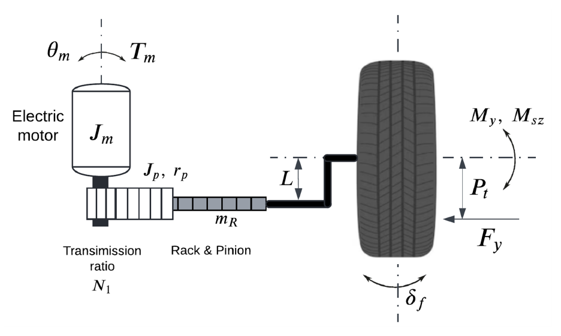

The steering system is modeled as a DC motor driving the steering rack, controlled using a PID controller. The PID coefficients are mapped as a function of the vehicle longitudinal speed.

The steering model operates in two modes depending on whether the suspension geometry effects are activated.

### When suspension geometry effects are activated:

- Steering resistance forces are calculated based on actual force and moment transfer from the tire contact patch to the steering rack  
- The instantaneous mechanical advantage between the rack and the wheels is calculated  
- The instantaneous kingpin unit vector is used  
- Actual steering geometry angles are considered  
- Indirect effects, such as the influence of variable camber angle on tire forces, are included  

  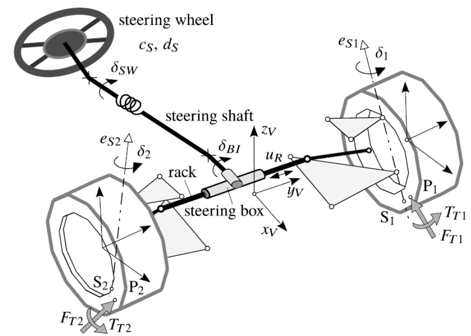
  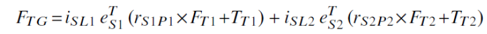 
  <em>Forces transferred from wheel to the rack</em>

### When suspension geometry effects are not activated:

- A simplified steering resistance force model is used  
- A constant mechanical advantage is assumed  
- Perfect Ackermann steering angles are assumed  

## BRAKING MODEL

  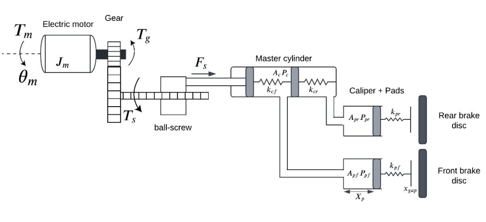

Main features of the braking model include:

- Stribeck friction model for the electromechanical actuator  
  (DC motor, gear reduction, and ball screw)
- Pressure and flow dynamics in the hydraulic system  
- Dual master cylinder chambers and brake pad cylinders  
- A stiffness-based clamping force applied to the brake disc  
- Consideration of the air gap between the brake pad and the rotor  
- A push-out pressure threshold required for pad movement  

**Assumptions used in the braking model:**

- A simple DC motor model  
- Laminar flow through brake pipes  
- Pipe and hose compliance is neglected  
- Pipeline dynamics and leakage are neglected  
- A linear and constant bulk modulus for the brake fluid  
- Heat generation and temperature-related changes in fluid properties are not considered  

  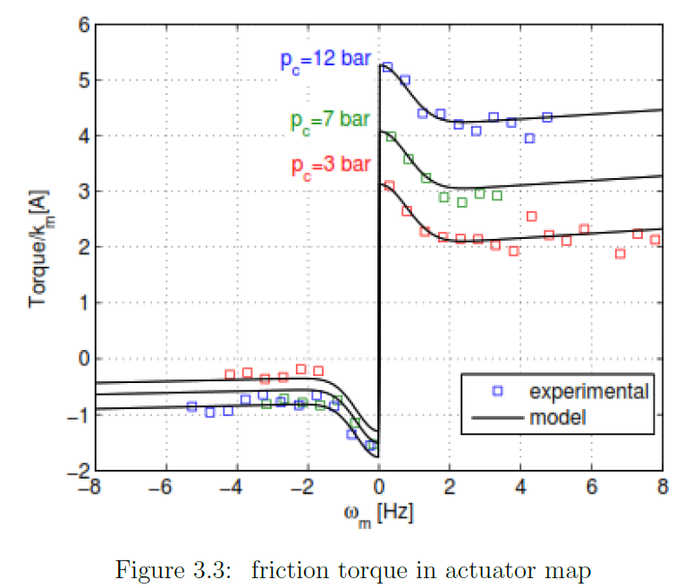
  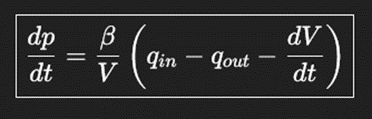
  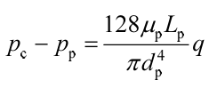

## ABS ALGORITHM

The ABS algorithm is currently under research and development and is not yet finalized.

## SUSPENSION GEOMETRY FUNCTIONS

  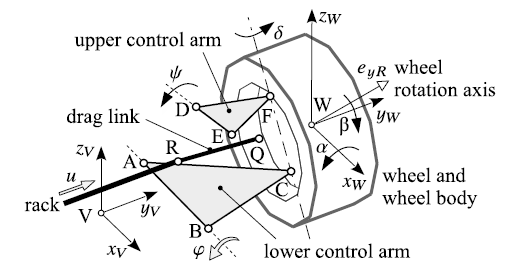

The suspension geometry module allows suspension and steering hard points to be defined in two ways:

- Manual assignment of hard-point locations  
- Automatic generation of hard points using design parameters  

The module provides exact analytical calculation of hard-point positions based on:

- Steering rack displacement  
- Main suspension angle (lower control arm angle)  

The following values are calculated instantaneously:

- Wheel angles  
- Suspension angles  
- Mechanical ratio between the steering rack and the wheels  
- Kingpin unit vectors  
- Wheel axis of rotation unit vectors  

  
  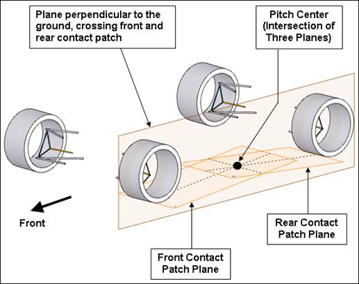

The instantaneous positions of the roll center and pitch center are also calculated and passed to the vehicle body dynamics calculations.

## VEHICLE BODY DYNAMICS

The suspension is modeled using linear springs and dampers.

  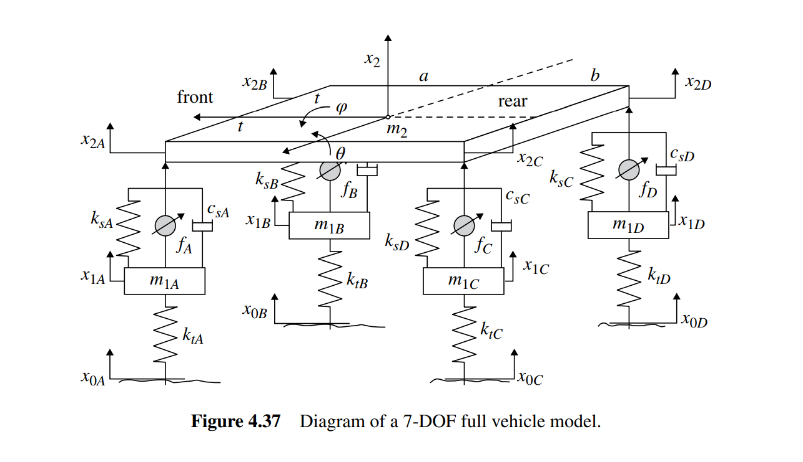

The vehicle dynamics model includes:

- Vertical motion of the four wheels  
- Vertical motion of the chassis  
- Chassis roll motion  
- Chassis pitch motion  

When suspension geometry effects are activated, the roll and pitch centers used in the roll and pitch calculations vary with suspension and steering motion.

The following effects are calculated:

- Aerodynamic forces and moments  
- Rolling resistance force  
- Longitudinal vehicle dynamics  
- Lateral vehicle dynamics  
- Yaw dynamics  
- Roll and pitch dynamics  

  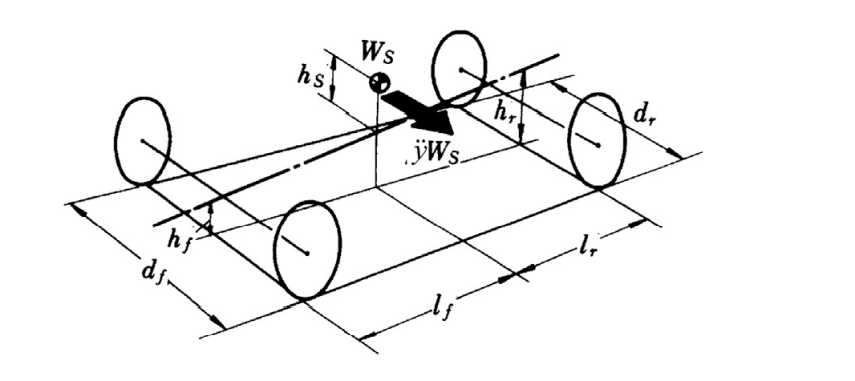 
  <em>Roll model</em>

**Limitations**

- Forces in suspension links are not considered, nor are actual spring and damper forces and their true directions of action.  
  The model uses simplified linear spring and damper forces proportional to wheel vertical motion relative to the body
  (vertical, roll, and pitch).

## TIRE MODEL

The tire forces are calculated using a **Pacejka tire model**.

**Inputs to the tire model:**

- Slip ratio  
- Slip angle  
- Camber angle  
- Normal force  

**Outputs from the tire model are:**

- Longitudinal force  
- Lateral force  
- Pneumatic trail  

**Limitations**

- Tire behavior is limited to the Pacejka formulation used and does not include transient or thermal tire effects.

## MODEL SCOPE AND INTENDED USE

This model is intended for engineering analysis, controller development, and system-level studies of vehicle behavior. It is designed to allow controlled comparison between simplified and more detailed modeling approaches by enabling or disabling specific subsystems and physical effects.

The model focuses on capturing the interaction between steering, braking, suspension geometry, tires, and vehicle body motions within a computationally manageable framework. It is not intended to replace high-fidelity commercial vehicle simulation tools at this stage.
